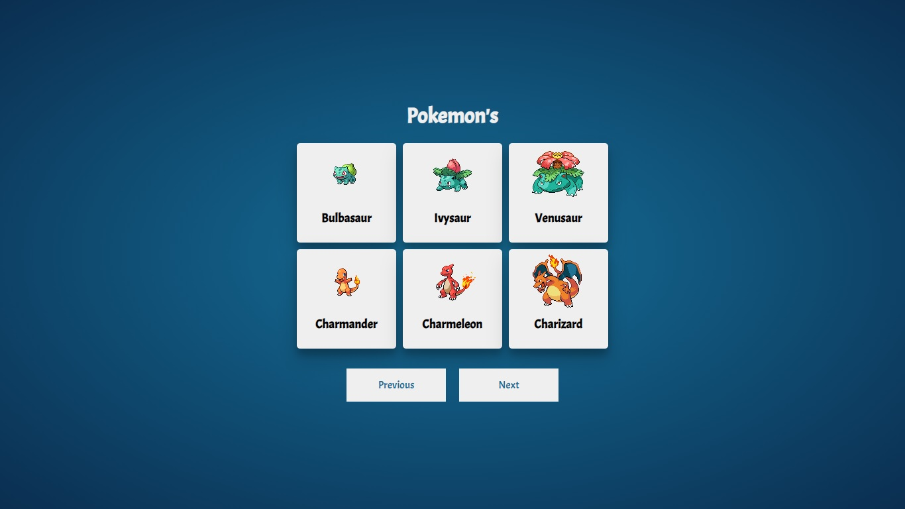
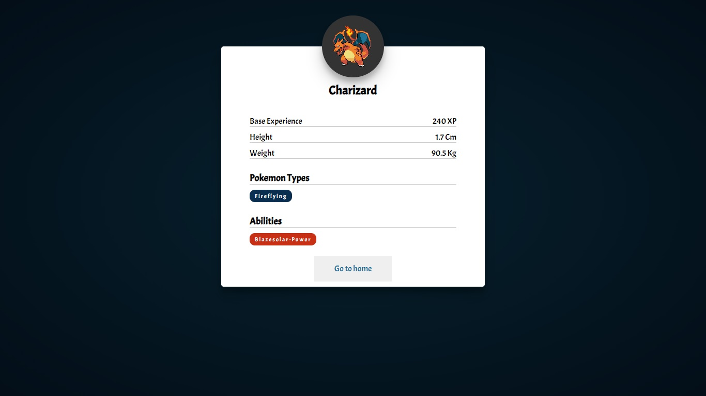

Pokedex Challenge React JS.

## Install

### `Clone repository`
`git clone https://github.com/gabrielcasafu/Pokedex.git`

### `Installing dependencies`
`npm install`

### `Launch`
`npm start`

### `Visualizacion`

